# Trabajo de Fin de Grado

## Fase 2 - Análisis y Diseño

> Alonso Hernández Robles 2º DAW AULA

### 1. Diagrama de Casos de Uso

    

### 2. Diagrama de Clases

    

### 3. Diagrama Entidad-Relación de la Base de Datos

    

#### 3.1. Paso a Tablas

- CATEGORIA(**id**, nombre)
- PRODUCTO(**id**, nombre, descripcion, precio, stock, oferta, fecha, imagen, *categoria_id*)
    - *categoria_id*: Clave foránea de CATEGORIA(id)
- PEDIDO(**id**, provincia, localidad, direccion, coste, estado, fecha, hora, *usuario_id*)
    - *usuario_id*: Clave foránea de USUARIO(id)
- USUARIO(**id**, nombre, apellidos, email, password, rol, imagen, color)
- LINEA_PEDIDO(**id**, unidades, *producto_id*, *pedido_id*)
    - *producto_id*: Clave foránea de PRODUCTO(id)
    - *pedido_id*: Clave foránea de PEDIDO(id)
- VALORACION(**id**, comentario, puntuacion, *usuario_id*, *producto_id*) 
    - *usuario_id*: Clave foránea de USUARIO(id)
    - *producto_id*: Clave foránea de PRODUCTO(id)

#### 3.2. Normalización

Todas las tablas están en 1FN, 2FN y 3FN.

### 4. Diseño de las Páginas

#### 4.0. Pop-Up de Aviso para Administradores

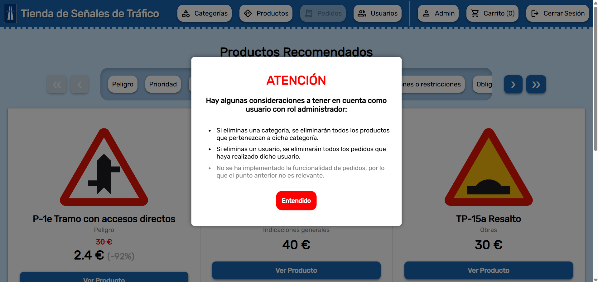

#### 4.1. Página de Inicio (Productos Recomendados)

#### 4.2. Página de Productos Filtrados por Categoría

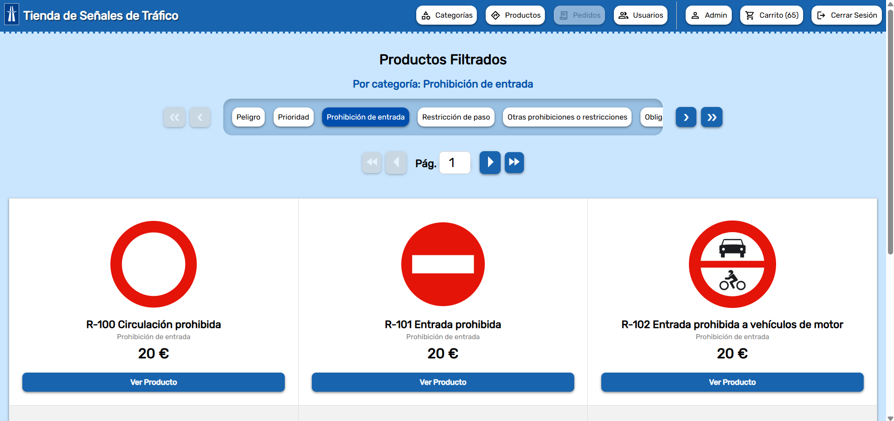

#### 4.3. Página de Producto

#### 4.4. Página de Registro

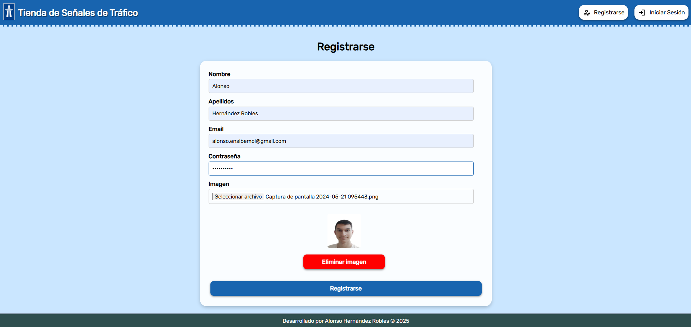

#### 4.5. Página de Inicio de Sesión

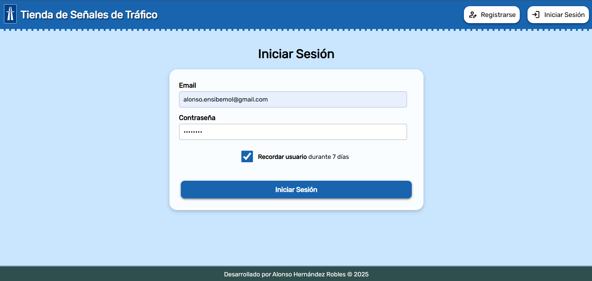

#### 4.6. Página de Gestión de Usuario

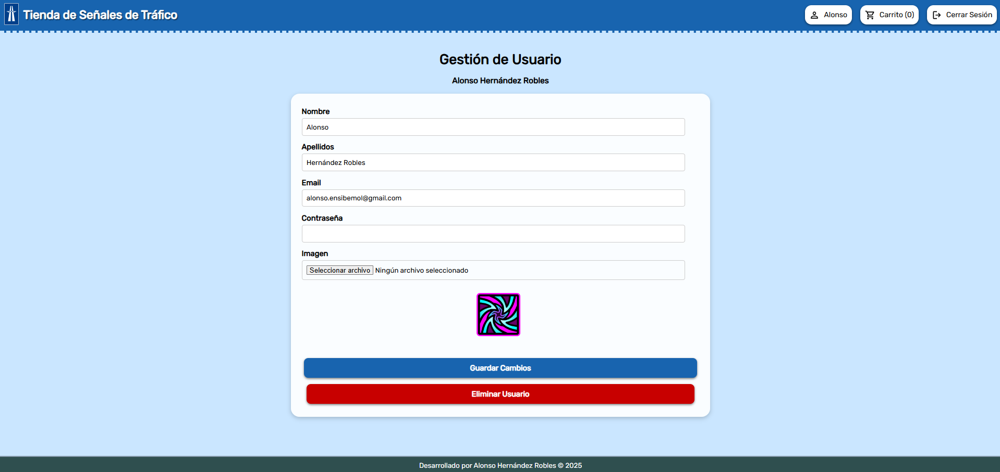

#### 4.7. Página de Carrito

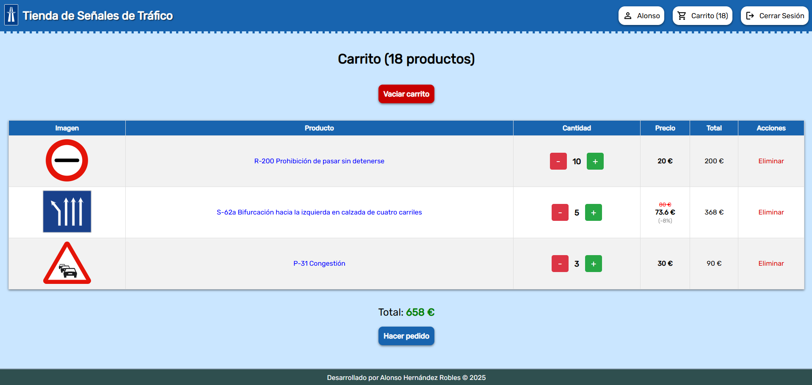

#### 4.8. Página de Hacer Pedido

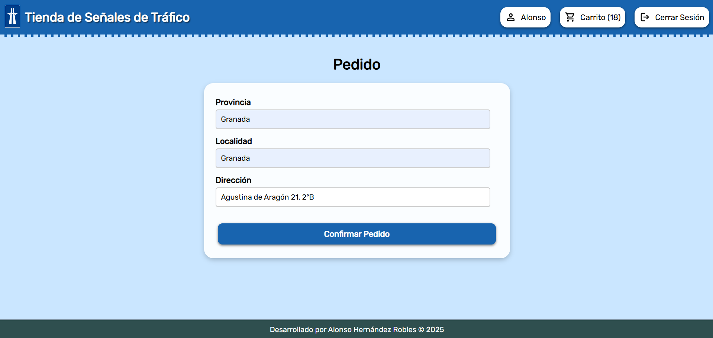

#### 4.9. Página de Pedido Listo (Pendiente a Confirmar)

#### 4.10. Página de Mis Pedidos

Se ideará en la siguiente y última fase, ya que no es totalmente relevante.

#### 4.11. Página de Administración de Categorías

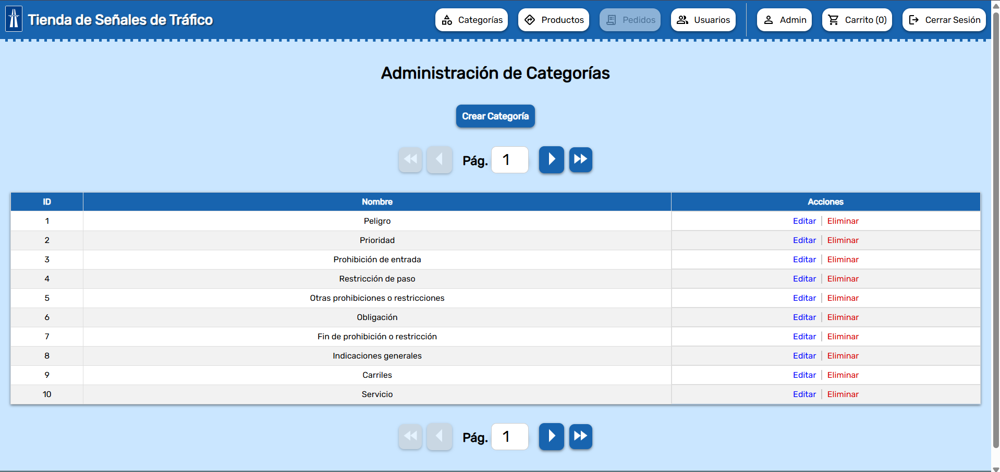

#### 4.12. Página de Creación de Categoría

#### 4.13. Página de Edición de Categoría

#### 4.14. Página de Administración de Productos

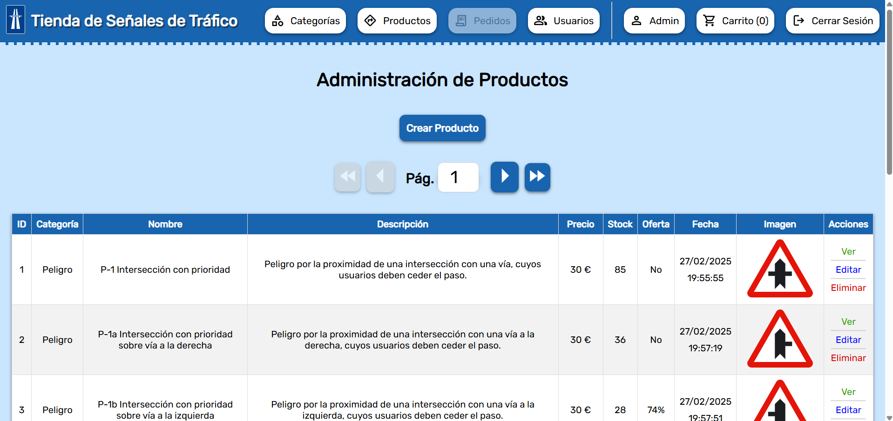

#### 4.15. Página de Creación de Producto

#### 4.16. Página de Edición de Producto

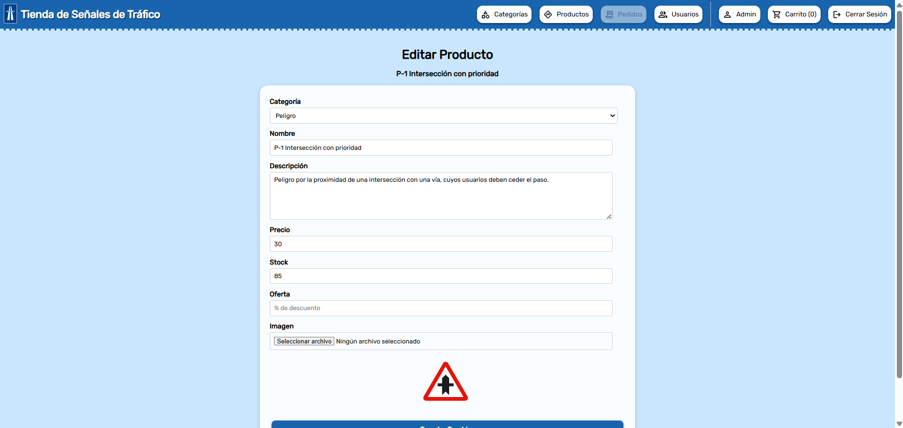

#### 4.17. Página de Administración de Usuarios

#### 4.18. Página de Creación de Usuario

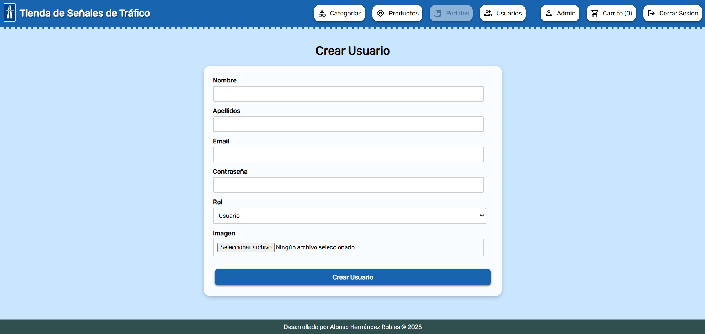

#### 4.19. Página de Edición de Usuario

#### 4.20. Página de Administración de Pedidos

Se ideará en la siguiente y última fase, ya que no es totalmente relevante.

#### 4.21. Página de Ver Pedido

Se ideará en la siguiente y última fase, ya que no es totalmente relevante.

#### 4.22. Página de Política de Privacidad

Se ideará en la siguiente y última fase, ya que no es totalmente relevante.

#### 4.23. Página de Condiciones de Uso

Se ideará en la siguiente y última fase, ya que no es totalmente relevante.

#### 4.24. Página de Sobre Nosotros

Se ideará en la siguiente y última fase, ya que no es totalmente relevante.

### 5. Mapa de Navegación

    

